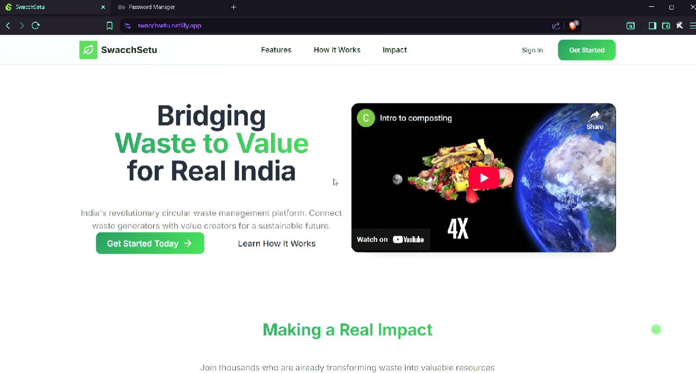
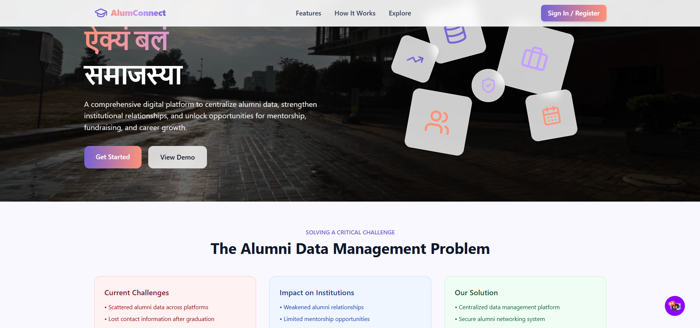
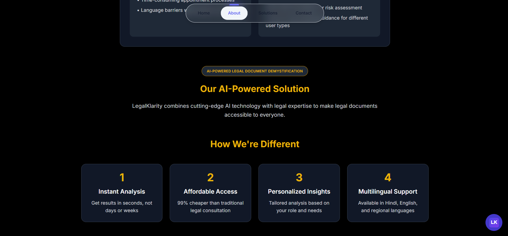

# My Hackathons

Documenting my hackathon projects

- [My Hackathons](#my-hackathons)
  - [Swacchsetu](#swacchsetu)
  - [AlumConnect](#alumconnect)
  - [LegalKlarity](#legalklarity)

---

## Swacchsetu

*Project for SIH '25. A smart solution for waste management, sanitation monitoring, and resource optimization via IOT Bin.*

* **Event:** [Smart India Hackathon 2025](https://www.sih.gov.in/sih2025PS)
* **PS Number:** SIH25014
* **Links:** [GitHub Repo](https://github.com/oyelurker/Swacchsetu) | [Devpost]() | [Problem Statement](media/sih-ps-25014.png)

---

## AlumConnect

*Project for SIH '25 by BugSlayers. A web-based platform designed to bridge the gap between alumni and their alma mater, fostering a strong and engaged community.*

* **Event:** [Smart India Hackathon 2025](https://www.sih.gov.in/sih2025PS)
* **PS Number:** SIH25017
* **Links:** [GitHub Repo](https://github.com/oyelurker/AlumConnect) | [Devpost]() | [Problem Statement](media/sih-ps-25017.png)

---

## LegalKlarity

*An AI-powered legal assistant designed to simplify complex legal jargon and provide clear insights.*

* **Event:** [Gen AI Exchange Hackathon](https://vision.hack2skill.com/event/genaiexchangehackathon)
* **Links:** [GitHub Repo](https://github.com/oyelurker/LegalKlarity) | [Devpost]() | [Demo]()

---
